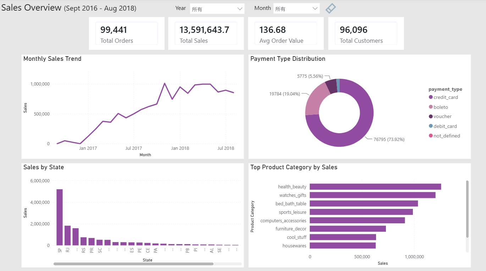
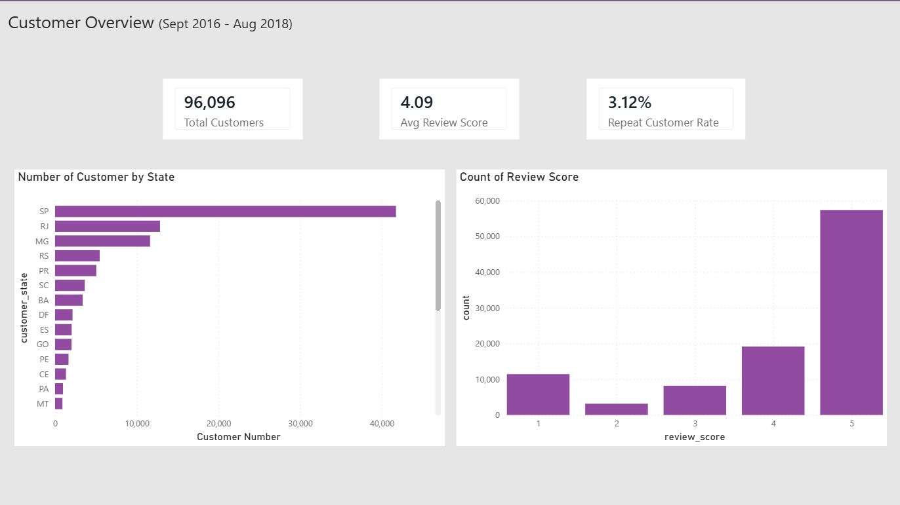
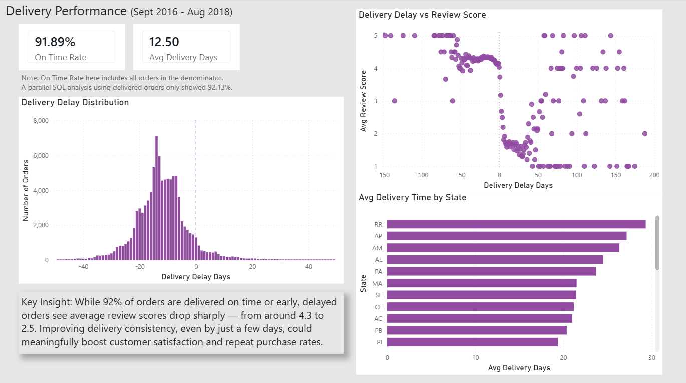

# Olist E-Commerce Performance Dashboard (Power BI)

A 3-page Power BI dashboard on the [Olist Brazilian E-Commerce dataset](https://www.kaggle.com/datasets/olistbr/brazilian-ecommerce), built to answer:

> **Why is the repeat customer rate so low (3.12%), and what's driving the polarized reviews?**

Companion project to my [SQL analysis](https://github.com/xinliin/olist-ecommerce-sql) of the same dataset.

## The Story

Sales grew steadily 2016–2018, but only 3.12% of customers ever ordered again, and reviews are polarized (lots of 5-stars, but more 1-stars than 2s and 3s combined).

The dashboard traces this to delivery: **92% of orders arrive on time or early**, but the ones that arrive late see review scores collapse — from ~4.3 to ~2.5, as a sharp cliff rather than a gradual drop. Delivery itself is solid; the issue is how much a small delay costs in customer sentiment.

*The screenshots below show all three pages of the dashboard. The interactive `.pbix` file is available on request (see Files section below).*

## Dashboard Pages

**1. Sales Overview** — orders, sales, AOV, monthly trend, payment types, top categories, sales by state

**2. Customer Overview** — total customers, repeat rate, avg review score, review distribution, customers by state

**3. Delivery Performance** — on-time rate, delivery delay distribution, **delay vs. review score**, delivery time by state

## Data Issues I Caught & Fixed

- **`customer_id` vs `customer_unique_id`** — Olist assigns a new `customer_id` per order, so repeat rate calculated naively comes out near 0%. Using `customer_unique_id` gives the real 3.12%.
- **Many-to-many relationship inflating totals** — sales-by-state numbers didn't match across two tables; traced to a many-to-many join with the `geolocation` table duplicating rows. Fixed by aggregating on `customer_state` only.
- **Small-sample bias** — a few categories with 2-3 orders showed extreme review scores. Added a ≥50-order minimum before ranking.
- **Date hierarchy trap** — an early trend chart silently merged all Januaries/Februaries across years. Fixed by using the raw date field.
- **Metric mismatch across tools** — On-Time Rate in Power BI (92%) vs. SQL (92.13%) differ due to denominator scope; documented directly on the dashboard rather than picking one silently.

## Tools

Power BI Desktop (modeling, relationships, Power Query) · DAX (`AVERAGEX`, `CALCULATE`, `DIVIDE`, `SUMMARIZE`+`FILTER`) · cross-validated against a separate SQL analysis

## Related

- [Olist SQL Analysis](https://github.com/xinliin/olist-ecommerce-sql)

## Files

This repo contains the README and page screenshots. The full `.pbix` file exceeds GitHub's web upload limit — happy to share it directly on request.
